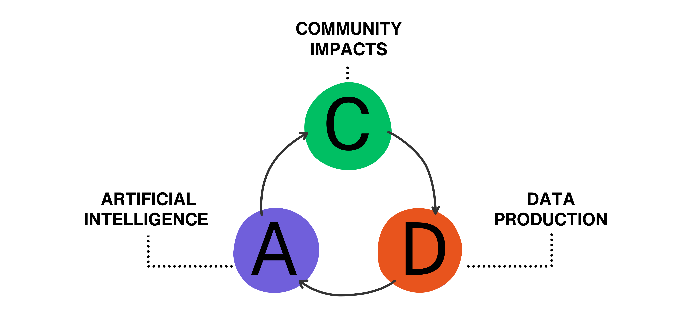
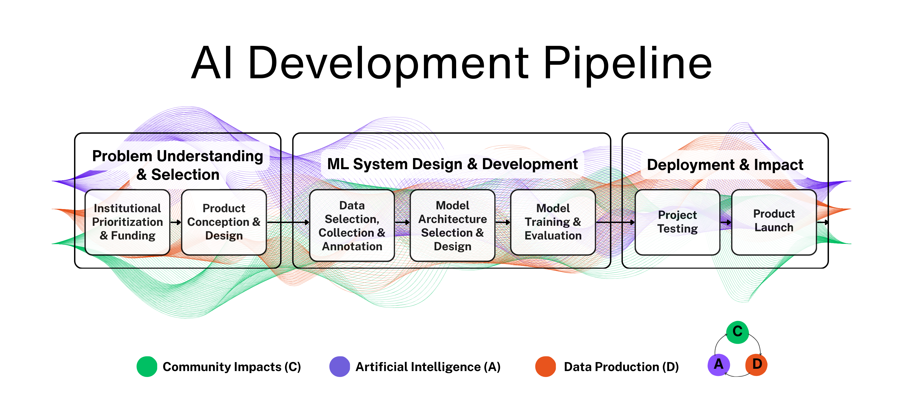

<html lang="en">
<head>
  <meta charset="utf-8" />
  <meta name="viewport" content="width=device-width,initial-scale=1" />
  <title>AI Data Production Landscape</title>
  <link rel="stylesheet" href="styles.css" />
</head>
<body>
  <header class="container">
   <h1>
      Welcome to the companion repository for <em>“Extractive Patterns and Equitable Pathways:
      A Landscape Analysis of AI Data Production Through Pipeline and Historical
      Perspectives.”</em>
    </h1>
    

      <a href="./V2_Extractive_Patterns_and_Equitable_Pathways.pdf">📄 Read the draft paper</a>
      <a href="https://github.com/chifod2025/ai-data-production-landscape" target="_blank" rel="noopener">GitHub repository</a>
    

  </header>
    <!-- ABSTRACT -->
    <section id="abstract">
      <h2>Abstract</h2>
      

        Artificial intelligence depends on data production processes that transform human knowledge into computational resources. Many approaches reproduce extractive dynamics rooted in histories of appropriation and dispossession. We conduct a multivocal landscape analysis of 350 sources on the relationship between AI systems, data production, and impacts on Indigenous, underrepresented, and underserved communities worldwide. Our synthesis identifies twelve extractive patterns and eleven less-extractive alternatives across the AI development pipeline. The literature exhibits an action gap: 256 sources diagnose extractive practices or advance normative principles, yet only 94 document concrete alternative practices. We contribute (1) a conceptual shift from data collection to data production that foregrounds sociotechnical complexity and power dynamics; (2) empirical mapping of sources across pipeline stages, historical eras, and geographic contexts; (3) an interpretive synthesis methodology bridging critical theory with technical analysis; and (4) an open corpus and interactive tools to support further inquiry.
      

        <main class="container">
 
      <figure>
        
        <figcaption>
          Fig. 1. A/D/C analytical framework for source analysis. Sources were coded based on substantive engagement with Community
Impacts (C), Artificial Intelligence (A), and/or Data Production (D). Arrows indicate the interconnected relationships between
dimensions that inform AI data production practices.
        </figcaption>
      </figure>
          
      <figure>
        
        <figcaption>
          Fig. 2. AI Development Pipeline with interconnected analytical dimensions. Three sine waves represent Community Impacts (green), Artificial Intelligence (purple), and Data Production (orange) flowing continuously through all pipeline stages, illustrating how these dimensions are present throughout the development process rather than confined to specific stages.
        </figcaption>
      </figure>
 

    <!-- TAXONOMY -->
    <section id="taxonomy">
      <h2>Taxonomy (illustrative, not exhaustive)</h2>
      
This project synthesizes extractive patterns and less-extractive pathways identified across the literature.

      

        

          <h3>Extractive patterns</h3>
          <ol>
            <li>Excluding underrepresented groups from decision-making</li>
            <li>Collecting vast amounts of data to train AI systems</li>
            <li>Reproducing biases through synthetic data generation</li>
            <li>Scraping or repurposing sensitive data</li>
            <li>Prioritizing data wants over community needs</li>
            <li>Soliciting data without reciprocal benefits</li>
            <li>Exploitative and invisible data labor</li>
            <li>Biased pre-processing and category erasure</li>
            <li>Opaque data practices</li>
            <li>Ethics dumping</li>
            <li>Deploying AI without local, contextual data</li>
            <li>Western-centric infrastructures</li>
          </ol>
        

        
        

          <h3>Less-extractive pathways</h3>
          <ol>
            <li>Decentering Western ontologies</li>
            <li>Needs-based development</li>
            <li>Early co-design and participation</li>
            <li>Consent and appropriate compensation</li>
            <li>Culturally inclusive datasets</li>
            <li>Community-engaged data production</li>
            <li>Crowdsourcing with safeguards</li>
            <li>Public visibility in dataset development</li>
            <li>Equitable data licensing</li>
            <li>Federated data spaces</li>
            <li>Participatory ownership and governance</li>
          </ol>
        

      

    </section>

    <!-- RESOURCES -->
    <section id="resources">
      <h2>Resources</h2>
      

        

          <h3>Paper</h3>
          
<a href="./V2_Extractive_Patterns_and_Equitable_Pathways.pdf">Read the latest paper draft (PDF)</a>

        

        

          <h3>Dataset</h3>
          

            <ul>
    <li><a href="https://docs.google.com/spreadsheets/d/1NJBIsDhtqp5CrCTJtfccObCneRLaRtoun6VfPuNTims/edit?usp=sharing" target="_blank" rel="noopener">Live Google Sheet</a></li> 
    <li><a href="https://github.com/chifod2025/ai-data-production-landscape/blob/main/data/raw/ai-data-production-landscape.xlsx">Raw Excel</a></li>
    <li><a href="https://github.com/chifod2025/ai-data-production-landscape/blob/main/data/processed/dataset.csv">Processed CSV</a></li>
    </ul>
          

        

        

          <h3>Interactive collections (open-source</h3>
          
Curated sets of publicly available sources (≤50 per collection), grouped by orientation.

          <ul>
    <li><a href="https://notebooklm.google.com/notebook/a048fa59-64b2-4b13-a98e-0e739bca49d7" target="_blank" rel="noopener">Extractive Patterns</a></li>
    <li><a href="https://notebooklm.google.com/notebook/f11a7a3b-dfbf-47a1-93e9-ee53683611ba" target="_blank" rel="noopener">Less-Extractive Principles</a></li>
    <li><a href="https://notebooklm.google.com/notebook/bd97ea3f-b516-48d5-b8c6-720ca8e47bca" target="_blank" rel="noopener">Less-Extractive Practices</a></li>
  </ul>
      

        

      

    </section>

    <!-- CONTACT -->
    <section id="contact">
      <h2>Contact</h2>
      
Email: <a href="mailto:chifod2025@gmail.com">chifod2025@gmail.com</a>

    </section>
  </main>
